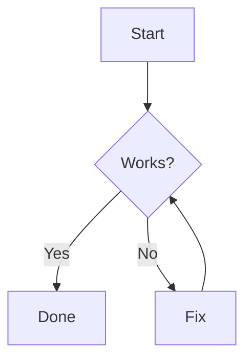

# Mermaid Live (Docker)

`mermaid-live` watches a folder of Mermaid source files and keeps rendered SVGs up to date while exposing a browser viewer and API.

This README focuses on running it with the published Docker image:

- `julsemaan/mermaid-live`

## Quick start

1. Create input/output folders:

```bash
mkdir -p diagrams diagrams-out
```

2. Add a sample Mermaid file in `diagrams/example.mmd`:



3. Run the container:

```bash
docker run --rm -it \
  -p 18000:18000 \
  -v "$(pwd)/diagrams:/diagrams:rw" \
  -v "$(pwd)/diagrams-out:/out:rw" \
  -e INPUT_DIR=/diagrams \
  -e OUT_DIR=/out \
  -e PORT=18000 \
  julsemaan/mermaid-live
```

4. Open the viewer:

- `http://localhost:18000`

When you create or edit `*.mmd` or `*.mermaid` files under `diagrams/`, SVGs are rendered into `diagrams-out/` (same relative paths, `.svg` extension).

## What gets written to output

The output folder contains:

- rendered SVG files
- `manifest.json` with diagram status/version metadata

Example:

```text
diagrams-out/
  manifest.json
  example.svg
  subdir/
    flow.svg
```

## Configuration

You can configure runtime behavior via environment variables.

| Variable             | Default                        | Notes                                                       |
| -------------------- | ------------------------------ | ----------------------------------------------------------- |
| `INPUT_DIR`          | `/diagrams` in container image | Folder to watch recursively for `.mmd` and `.mermaid` files |
| `OUT_DIR`            | `./.mermaid-live-out`          | Output folder for SVGs and `manifest.json`                  |
| `PORT`               | `18000`                        | HTTP port for viewer + API                                  |
| `LOG_LEVEL`          | `info`                         | `fatal`, `error`, `warn`, `info`, `debug`, `trace`          |
| `WATCH_DEBOUNCE_MS`  | `300`                          | Debounce window for filesystem events (`50` to `5000`)      |
| `RENDER_CONCURRENCY` | `1`                            | Number of concurrent renders (`1` to `8`)                   |

You can also pass CLI flags after the image name (for example `--port 19000`).

## HTTP endpoints

- `GET /` - web viewer
- `GET /diagram/:id` - single-diagram viewer route
- `GET /api/diagrams` - list diagrams
- `GET /api/diagrams/:id` - diagram metadata
- `GET /api/diagrams/:id/svg` - rendered SVG
- `GET /api/events` - SSE stream (`diagram.created`, `diagram.updated`, `diagram.failed`, `diagram.deleted`)
- `GET /api/health` - health snapshot
- `GET /api/metrics` - Prometheus-style metrics

## Docker Compose example

```yaml
services:
  mermaid-live:
    image: julsemaan/mermaid-live
    container_name: mermaid-live
    ports:
      - "18000:18000"
    environment:
      INPUT_DIR: /diagrams
      OUT_DIR: /out
      PORT: 18000
      LOG_LEVEL: info
      WATCH_DEBOUNCE_MS: 300
      RENDER_CONCURRENCY: 1
    volumes:
      - ./diagrams:/diagrams
      - ./diagrams-out:/out
```

Start it with:

```bash
docker compose up
```

## Troubleshooting

- No SVG files appear: verify `OUT_DIR` points to a mounted host folder.
- Viewer is unreachable: ensure `-p <hostPort>:<containerPort>` matches `PORT`.
- Diagram shows failed status: check container logs for Mermaid parse/render errors.
